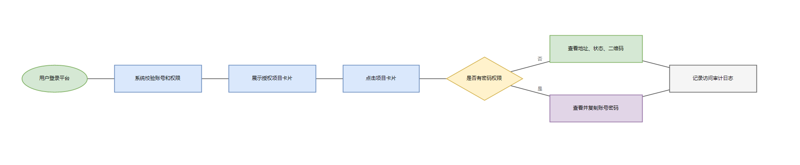
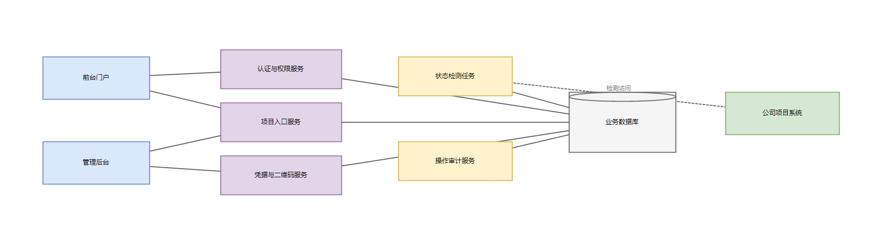
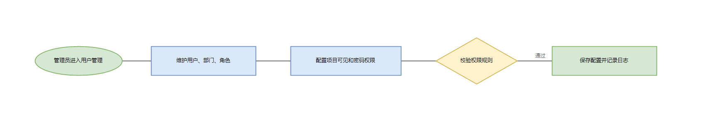
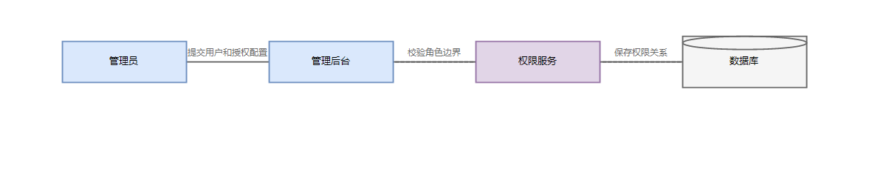
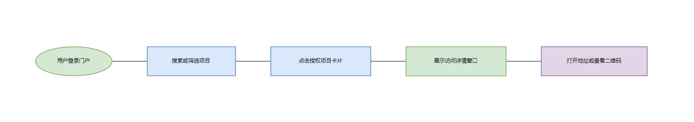
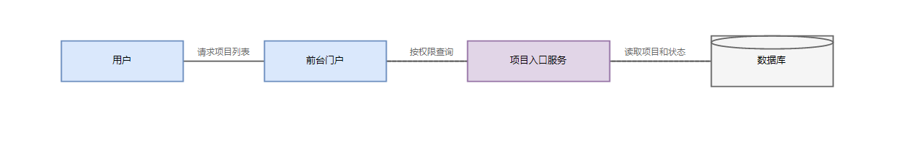
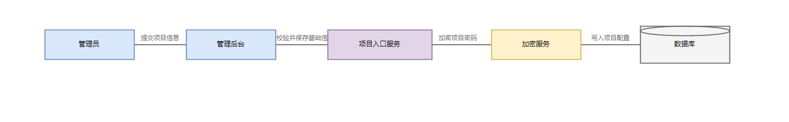
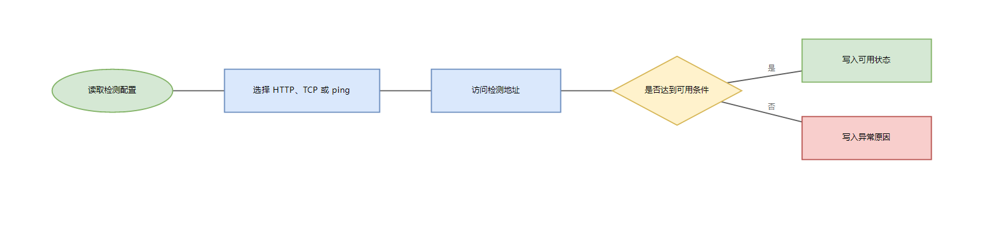
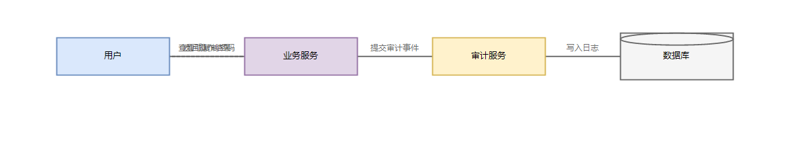

# 一、文档信息

| 项目名称 | 公司一体化平台 |
|---------|---------------|
| 文档版本 | V1.0 |
| 编制日期 | 2026-06-04 |
| 编制人 | 一体化平台项目组 |
| 审核人 | - |
| 批准人 | - |
| 客户单位 | 公司内部 |
| 编制单位 | 一体化平台项目组 |
| 适用范围 | 公司内部统一应用门户、后台管理和项目访问资料管理 |
| 核心目标 | 建设统一入口，集中管理项目地址、账号凭据、小程序二维码、系统状态、权限和审计日志 |
| 文档状态 | 草稿 |

**历史版本**

| 版本 | 日期 | 作者 | 更改说明 |
|-----|------|------|---------|
| V1.0 | 2026-06-04 | 一体化平台项目组 | 初始版本，基于已确认设计方案生成 |

# 二、项目概述

## 2.1 项目背景

随着公司内部系统、客户项目、数据平台、AI 工具、小程序和运维服务数量增加，员工日常访问系统时面临以下问题：

1. **系统入口分散**：项目地址散落在浏览器书签、聊天记录、文档和个人收藏中，员工查找成本高，新员工上手慢。
2. **访问资料不统一**：不同项目的 Web 地址、账号、密码、小程序二维码和使用说明缺少统一维护位置，资料更新后难以及时同步。
3. **权限边界不清晰**：部分项目账号密码属于敏感信息，不同部门和角色需要不同查看范围，单纯共享文档难以做到可控访问。
4. **系统状态不可感知**：员工访问项目时无法提前判断目标系统是否可用，出现网络、服务异常或维护时缺少统一提示。
5. **敏感行为缺少审计**：查看密码、复制密码、修改访问资料等操作需要留痕，便于后续追溯和安全管理。

为解决以上问题，建设公司一体化平台，实现统一登录、统一展示、统一维护、统一授权和统一审计，提升公司内部项目访问效率和管理安全性。

## 2.2 项目建设目标

本项目旨在建设一套公司内部统一应用门户，实现以下目标：

1. **统一项目入口**：员工登录平台后，可按分类、关键词和状态快速定位授权项目。
2. **集中访问资料**：在项目详情窗口中统一展示 Web 地址、账号凭据、小程序二维码、系统状态、使用说明和维护联系人。
3. **精细权限控制**：按用户、部门和角色控制项目可见范围，并单独控制账号密码查看和复制权限。
4. **自动状态检测**：通过 HTTP/HTTPS、TCP 和 ping 辅助检测项目是否可达，结合人工覆盖状态展示系统可用性。
5. **后台可持续维护**：管理员可维护项目卡片、详情内容、账号凭据、二维码、检测规则、权限和审计日志。
6. **敏感操作可追溯**：对登录、打开项目详情、查看密码、复制密码、后台修改等行为进行记录。

## 2.3 项目建设范围

**系统端**

- PC 端前台门户：面向公司员工和授权用户。
- PC 端管理后台：面向超级管理员、项目管理员和部门管理员。

**功能模块**

- 账号与权限管理：用户、部门、角色、项目授权、密码查看权限。
- 应用门户访问：项目卡片、分类筛选、关键词搜索、状态筛选、项目详情窗口。
- 项目卡片与详情内容管理：项目基础信息、访问地址、账号凭据、小程序二维码、访问说明、维护联系人。
- 状态检测管理：检测配置、定时检测、立即检测、人工状态覆盖、检测记录。
- 操作日志与审计：登录日志、访问日志、密码查看日志、复制日志、后台修改日志。

**数据范围**

- 平台用户、部门、角色、权限关系。
- 项目基础信息、分类、标签、Logo、排序、启用状态。
- 项目访问地址、账号凭据、小程序二维码、使用说明。
- 状态检测配置、检测记录、人工覆盖状态。
- 用户访问和后台管理操作日志。

**暂不包含的功能**

- 第一阶段不包含企业微信、钉钉、LDAP 或统一身份认证接入，后续可扩展。
- 第一阶段不要求对外部项目系统做单点登录改造，仍以地址、凭据和二维码集中管理为主。
- 第一阶段不做项目系统业务数据汇聚，仅管理访问入口和访问资料。

## 2.4 业务流程图

## 2.5 业务角色定义

| 角色名称 | 角色描述 | 主要职责 | 权限范围 |
|---------|---------|---------|---------|
| 超级管理员 | 平台最高权限管理人员 | 维护用户、部门、角色、项目、权限、状态检测和日志 | 全部功能 |
| 项目管理员 | 负责指定项目访问资料维护的人员 | 维护负责项目的卡片、地址、凭据、二维码、说明和状态配置 | 指定项目管理权限 |
| 部门管理员 | 负责本部门用户和项目授权协调的人员 | 查看本部门用户，维护本部门授权范围内的项目信息 | 本部门范围 |
| 普通员工 | 公司内部日常使用人员 | 查看授权项目，打开项目地址，按权限查看访问资料 | 授权项目查看权限 |
| 访客用户 | 临时或外部协作人员 | 查看指定项目入口和说明 | 指定项目有限查看权限 |

# 三、项目建设内容

## 3.1 总体功能架构

**PC 端前台门户**

- 首页（单页门户）
  - 项目卡片展示（功能区）
  - 分类筛选（功能区）
  - 关键词搜索（功能区）
  - 状态筛选（功能区）

**PC 端管理后台**

- 系统管理（一级菜单）
  - 用户管理（二级菜单）
  - 部门管理（二级菜单）
  - 角色管理（二级菜单）
- 项目管理（一级菜单）
  - 项目卡片管理（二级菜单）
  - 详情内容管理（二级菜单）
  - 凭据与二维码管理（二级菜单）
- 状态检测（一级菜单）
  - 检测配置（二级菜单）
  - 检测记录（二级菜单）
- 权限与审计（一级菜单）
  - 项目权限配置（二级菜单）
  - 操作日志（二级菜单）

## 3.2 需求功能清单

| 序号 | 业务需求 | 需求概述 | 优先级 |
|-----|---------|---------|-------|
| 1 | 用户身份认证 | 平台用户通过账号密码登录，系统校验账号状态并建立访问会话 | P0 |
| 2 | 组织与角色授权 | 系统按用户所属部门、角色和额外授权计算项目可见范围 | P0 |
| 3 | 项目统一门户 | 员工在首页查看授权项目卡片，并支持分类筛选和关键词搜索 | P0 |
| 4 | 项目详情查看 | 用户点击项目卡片后查看地址、状态、二维码、说明和维护联系人 | P0 |
| 5 | 账号密码权限控制 | 用户具备权限时可查看和复制项目账号密码，无权限时不返回敏感内容 | P0 |
| 6 | 项目后台维护 | 管理员维护项目卡片、地址、凭据、二维码、说明和启用状态 | P0 |
| 7 | 状态自动检测 | 系统按配置定时检测项目地址是否可达，并展示最近检测结果 | P0 |
| 8 | 人工状态覆盖 | 管理员可将项目状态设置为维护中、异常、正常或未检测 | P1 |
| 9 | 操作日志审计 | 系统记录登录、打开详情、查看密码、复制密码和后台修改行为 | P0 |
| 10 | 批量导入项目 | 管理员可批量导入项目基础资料和地址信息 | P2 |
| 11 | 密码到期提醒 | 系统可记录凭据到期时间并提醒管理员更新 | P2 |

## 3.3 页面功能清单

| 终端 | 一级菜单 | 二级菜单 | 子功能 | 功能描述 |
|-----|---------|---------|-------|---------|
| PC端 | 登录页 | - | 登录 | 输入账号和密码后进入平台 |
| ^ | ^ | - | 找回密码提示 | 根据平台规则提示联系管理员或走密码重置流程 |
| ^ | 首页 | 项目卡片展示 | 列表 | 展示用户有权查看的项目卡片 |
| ^ | ^ | ^ | 分类筛选 | 按项目分类查看项目卡片 |
| ^ | ^ | ^ | 关键词搜索 | 按项目名称、简称、标签和说明搜索 |
| ^ | ^ | ^ | 状态筛选 | 按可用、异常、维护中、未检测筛选 |
| ^ | ^ | 项目详情 | 查看详情 | 查看项目地址、状态、二维码、说明和维护联系人 |
| ^ | ^ | ^ | 打开地址 | 打开项目配置的 Web 地址 |
| ^ | ^ | ^ | 复制地址 | 复制项目访问地址 |
| ^ | ^ | ^ | 查看密码 | 在具备权限时查看项目账号密码 |
| ^ | ^ | ^ | 复制密码 | 在具备权限时复制项目账号或密码 |
| PC端 | 系统管理 | 用户管理 | 筛选 | 按姓名、账号、部门、角色、状态筛选用户 |
| ^ | ^ | ^ | 列表 | 分页查看用户列表 |
| ^ | ^ | ^ | 新增 | 创建平台登录用户 |
| ^ | ^ | ^ | 编辑 | 修改用户姓名、部门、角色和状态 |
| ^ | ^ | ^ | 重置密码 | 为指定用户重置登录密码 |
| ^ | ^ | ^ | 启用/停用 | 控制用户是否允许登录 |
| ^ | ^ | 部门管理 | 列表 | 查看部门层级结构 |
| ^ | ^ | ^ | 新增 | 创建部门记录 |
| ^ | ^ | ^ | 编辑 | 修改部门名称、上级部门和排序 |
| ^ | ^ | ^ | 启用/停用 | 控制部门是否可用于授权 |
| ^ | ^ | 角色管理 | 列表 | 查看角色列表和权限范围 |
| ^ | ^ | ^ | 新增 | 创建平台角色 |
| ^ | ^ | ^ | 编辑 | 修改角色名称、说明和权限 |
| ^ | ^ | ^ | 启用/停用 | 控制角色是否可分配给用户 |
| PC端 | 项目管理 | 项目卡片管理 | 筛选 | 按分类、状态、维护人、启用状态筛选项目 |
| ^ | ^ | ^ | 列表 | 分页查看项目卡片列表 |
| ^ | ^ | ^ | 新增 | 创建项目卡片基础信息 |
| ^ | ^ | ^ | 编辑 | 修改项目名称、Logo、分类、标签、排序和说明 |
| ^ | ^ | ^ | 删除 | 删除未被访问资料引用的项目 |
| ^ | ^ | ^ | 启用/停用 | 控制项目前台是否展示 |
| ^ | ^ | 详情内容管理 | 地址维护 | 维护正式地址、测试地址、后台地址和文档地址 |
| ^ | ^ | ^ | 账号维护 | 维护项目账号、加密密码、适用环境和说明 |
| ^ | ^ | ^ | 二维码维护 | 上传、替换、预览和停用小程序二维码 |
| ^ | ^ | ^ | 说明维护 | 维护浏览器要求、VPN 要求、注意事项和维护联系人 |
| PC端 | 状态检测 | 检测配置 | 列表 | 查看各项目检测配置 |
| ^ | ^ | ^ | 编辑 | 配置检测方式、地址、频率、超时时间和期望状态码 |
| ^ | ^ | ^ | 立即检测 | 手动触发一次项目状态检测 |
| ^ | ^ | ^ | 人工状态 | 设置正常、异常、维护中或未检测 |
| ^ | ^ | 检测记录 | 查询 | 按项目、状态、时间范围查询检测记录 |
| ^ | ^ | ^ | 详情 | 查看响应耗时、错误原因和检测方式 |
| PC端 | 权限与审计 | 项目权限配置 | 授权 | 设置项目可见部门、角色和用户 |
| ^ | ^ | ^ | 密码权限 | 设置密码查看和复制权限 |
| ^ | ^ | 操作日志 | 查询 | 按用户、项目、操作类型和时间范围查询日志 |
| ^ | ^ | ^ | 导出 | 导出当前筛选结果 |

## 3.4 页面访问权限

| 功能模块 | 超级管理员 | 项目管理员 | 部门管理员 | 普通员工 | 访客用户 |
|---------|-----------|-----------|-----------|---------|---------|
| 登录页 | 使用 | 使用 | 使用 | 使用 | 使用 |
| 门户首页 | 查看全部授权项目 | 查看授权项目 | 查看本部门授权项目 | 查看授权项目 | 查看指定项目 |
| 项目详情 | 查看全部详情 | 查看负责项目详情 | 查看本部门授权项目详情 | 查看授权项目详情 | 查看指定项目基础详情 |
| 查看项目密码 | 全部项目可查看 | 负责项目可查看 | 按授权查看 | 按授权查看 | 无 |
| 复制项目密码 | 全部项目可复制 | 负责项目可复制 | 按授权复制 | 按授权复制 | 无 |
| 用户管理 | 全部权限 | 无 | 查看本部门用户 | 无 | 无 |
| 部门管理 | 全部权限 | 无 | 查看本部门 | 无 | 无 |
| 角色管理 | 全部权限 | 查看 | 无 | 无 | 无 |
| 项目卡片管理 | 全部权限 | 负责项目全部权限 | 本部门授权项目查看 | 无 | 无 |
| 详情内容管理 | 全部权限 | 负责项目全部权限 | 本部门授权项目查看 | 无 | 无 |
| 凭据与二维码管理 | 全部权限 | 负责项目全部权限 | 无 | 无 | 无 |
| 状态检测配置 | 全部权限 | 负责项目配置 | 本部门授权项目查看 | 无 | 无 |
| 检测记录 | 全部查看 | 负责项目查看 | 本部门授权项目查看 | 无 | 无 |
| 项目权限配置 | 全部权限 | 负责项目建议配置 | 本部门授权建议配置 | 无 | 无 |
| 操作日志 | 全部查看和导出 | 负责项目查看 | 本部门日志查看 | 个人相关日志查看 | 无 |

权限规则：

- 无项目可见权限时，前台不展示对应项目。
- 有项目可见权限但无密码权限时，详情窗口不返回明文密码。
- 查看密码和复制密码属于敏感操作，必须单独授权并记录审计日志。
- 项目管理员只能维护负责项目，不能越权查看其他项目凭据。
- 部门管理员只能查看和协调本部门范围内的授权项目。

## 3.5 功能详细设计

### 3.5.1 账号与权限管理

#### （一）功能需求概述

账号与权限管理用于维护平台登录用户、组织部门、系统角色和项目授权关系。该模块决定用户登录后可查看哪些项目、是否可查看项目账号密码，以及是否可进入后台维护数据。

#### （二）功能设计

**用户管理**

支持按以下条件筛选，条件之间为“并且”关系，点击搜索按钮触发查询：

| 筛选字段 | 类型 | 说明 |
|---------|------|------|
| 用户姓名 | 文本输入 | 支持模糊搜索 |
| 登录账号 | 文本输入 | 支持精确或模糊搜索 |
| 所属部门 | 层级选择 | 来源于已启用部门 |
| 角色 | 下拉选择 | 来源于已启用角色 |
| 用户状态 | 下拉选择 | 启用、停用、锁定 |

用户列表字段如下：

| 列名 | 字段类型 | 说明 |
|-----|---------|------|
| 用户姓名 | 文本 | 用户真实姓名 |
| 登录账号 | 文本 | 平台登录账号，系统内唯一 |
| 所属部门 | 文本 | 用户所属部门 |
| 角色 | 文本 | 用户分配的角色，可多个 |
| 手机号 | 文本 | 用于联系和身份核对 |
| 状态 | 文本 | 启用、停用、锁定 |
| 最近登录时间 | 日期时间 | 最近一次登录成功时间 |
| 操作 | 操作按钮 | 编辑、重置密码、启用、停用 |

新增或编辑用户时填写以下字段：

| 字段名称 | 类型 | 长度限制 | 必填 | 默认值 | 说明 |
|---------|------|---------|------|-------|------|
| 用户姓名 | 文本输入 | 2-30字 | 是 | - | 用户真实姓名 |
| 登录账号 | 文本输入 | 4-50字 | 是 | - | 系统内唯一 |
| 初始密码 | 密码输入 | 8-30字 | 新增时是 | - | 首次登录后建议修改 |
| 所属部门 | 层级选择 | - | 是 | - | 来源于已启用部门 |
| 角色 | 多选 | - | 是 | 普通员工 | 来源于已启用角色 |
| 手机号 | 文本输入 | 11位 | 否 | - | 用于联系 |
| 状态 | 下拉选择 | - | 是 | 启用 | 启用、停用 |

**部门管理**

部门管理用于建立公司组织层级。部门字段包括部门名称、上级部门、部门负责人、排序、启用状态。停用部门后，该部门不可再用于新增授权，但历史授权记录保留。

**角色管理**

角色管理用于定义后台操作权限和前台默认访问能力。内置角色包括超级管理员、项目管理员、部门管理员、普通员工、访客用户。角色停用后不可继续分配给新用户，已分配用户的权限按停用规则失效。

**项目授权**

项目授权支持按部门、角色和用户配置。授权范围包括项目可见、密码查看、密码复制、二维码查看。用户同时命中多条授权规则时，项目可见权限取并集，敏感操作按更严格规则校验。

**业务规则**

- 登录账号在系统内全局唯一。新增或编辑时若重复，阻止提交，提示“登录账号已存在，请更换”。
- 停用用户后，该用户不可登录平台，已建立的访问会话应失效。
- 用户无项目可见权限时，前台不展示对应项目。
- 用户无密码查看权限时，详情窗口不返回明文密码。
- 查看密码和复制密码前必须再次校验当前用户权限。

**边界与异常**

- **空数据**：用户列表无数据时，显示“暂无用户数据”。
- **权限不足**：无权限用户不展示对应操作入口。
- **密码规则不满足**：提交时阻止保存，提示“密码需包含字母和数字，长度不少于8位”。
- **部门停用**：停用部门下仍有启用用户时，提示“该部门下存在启用用户，请先调整用户部门”。

#### （三）业务逻辑关联

- 账号与权限管理为应用门户访问、项目详情查看、后台项目维护和日志审计提供用户身份与授权依据。
- 项目授权变更后，影响用户前台项目可见范围和密码查看能力。

#### （四）用户操作流程图

#### （五）功能时序图

### 3.5.2 应用门户访问

#### （一）功能需求概述

应用门户访问用于员工登录后查看公司相关项目入口。用户可以通过分类、关键词和状态快速找到授权项目，点击项目卡片后查看项目详情信息。

#### （二）功能设计

**项目卡片列表**

项目卡片展示字段如下：

| 字段名称 | 类型 | 说明 |
|---------|------|------|
| 项目Logo | 图片 | 未配置时显示默认图形 |
| 项目名称 | 文本 | 显示项目全称 |
| 项目简称 | 文本 | 用于辅助识别和紧凑展示 |
| 项目分类 | 文本 | 内部系统、客户项目、AI工具、数据平台、运维服务、小程序等 |
| 项目状态 | 文本 | 可用、异常、维护中、未检测 |
| 项目简介 | 文本 | 首页卡片限制展示摘要内容 |
| 项目标签 | 文本 | 正式、测试、内网、外网、小程序等 |

支持以下筛选方式：

| 筛选字段 | 类型 | 说明 |
|---------|------|------|
| 关键词 | 文本输入 | 支持按项目名称、简称、标签、说明搜索 |
| 项目分类 | 下拉选择 | 来源于项目分类配置 |
| 项目状态 | 下拉选择 | 可用、异常、维护中、未检测 |

**项目详情窗口**

点击项目卡片后打开详情窗口，展示以下内容：

| 信息分区 | 展示内容 | 权限要求 |
|---------|---------|---------|
| 基本信息 | 项目名称、Logo、分类、标签、简介、维护人 | 项目可见权限 |
| 系统状态 | 当前状态、最近检测时间、响应耗时、异常原因 | 项目可见权限 |
| 访问地址 | 正式地址、测试地址、后台地址、文档地址 | 项目可见权限 |
| 账号凭据 | 用户名、密码、账号说明、适用环境 | 密码查看权限 |
| 小程序入口 | 二维码图片、二维码说明 | 二维码查看权限 |
| 访问说明 | 浏览器要求、VPN要求、注意事项 | 项目可见权限 |

**首页展示策略**

首页项目卡片仅展示项目名称、简称、Logo、分类、状态、简介、标签和详情入口，维护人、响应耗时、最近检测时间和异常原因集中在项目详情窗口展示，避免卡片信息过多影响首页浏览效率。

**业务规则**

- 前台项目列表仅展示当前用户有权查看的项目。
- 项目停用后，前台不展示该项目。
- 密码默认不展示，用户主动点击查看密码后，系统校验权限并记录日志。
- 用户点击复制地址、复制账号或复制密码时，系统记录操作日志。
- 状态为异常或维护中时，仍允许用户查看地址和说明。

**边界与异常**

- **无授权项目**：首页显示“暂无可访问项目，请联系管理员授权”。
- **二维码缺失**：详情窗口显示“暂未配置小程序二维码”。
- **检测结果过期**：最近检测时间超过配置周期两倍时，显示“检测结果可能已过期”。
- **地址不可用**：点击打开地址失败时，提示“无法打开项目地址，请检查网络或联系维护人”。

#### （三）业务逻辑关联

- 应用门户访问依赖账号与权限管理返回的项目可见范围。
- 项目详情窗口依赖项目卡片与详情内容管理提供地址、凭据、二维码和说明。
- 状态展示依赖状态检测管理提供最近检测结果。
- 敏感查看和复制行为写入操作日志与审计模块。

#### （四）用户操作流程图

#### （五）功能时序图

### 3.5.3 项目卡片与详情内容管理

#### （一）功能需求概述

项目卡片与详情内容管理用于维护前台门户展示的项目入口，以及项目详情窗口中的地址、账号凭据、小程序二维码、使用说明和维护联系人。该模块是平台内容运营的核心。

#### （二）功能设计

**项目卡片管理**

支持按项目名称、分类、维护人、启用状态、项目状态筛选项目。项目列表字段如下：

| 列名 | 字段类型 | 说明 |
|-----|---------|------|
| 项目名称 | 文本 | 项目全称 |
| 项目简称 | 文本 | 用于搜索和紧凑展示 |
| 项目Logo | 图片 | 前台卡片展示图 |
| 项目分类 | 文本 | 来源于分类配置 |
| 项目标签 | 文本 | 支持多个标签 |
| 维护人 | 文本 | 项目资料维护负责人 |
| 启用状态 | 文本 | 启用、停用 |
| 排序 | 数值 | 前台同分类下排序 |

新增或编辑项目卡片时填写以下字段：

| 字段名称 | 类型 | 长度限制 | 必填 | 默认值 | 说明 |
|---------|------|---------|------|-------|------|
| 项目名称 | 文本输入 | 2-100字 | 是 | - | 系统内唯一 |
| 项目简称 | 文本输入 | 2-30字 | 否 | - | 用于搜索 |
| 项目Logo | 图片上传 | 单张 | 否 | 默认图形 | 支持替换 |
| 项目分类 | 下拉选择 | - | 是 | 内部系统 | 来源于分类配置 |
| 项目标签 | 多选 | - | 否 | - | 正式、测试、内网、外网等 |
| 项目简介 | 多行文本 | 0-300字 | 否 | - | 前台详情展示 |
| 维护人 | 用户选择 | - | 否 | - | 来源于启用用户 |
| 排序 | 数值输入 | 1-9999 | 是 | 100 | 值越小越靠前 |
| 启用状态 | 下拉选择 | - | 是 | 启用 | 启用、停用 |

**访问地址维护**

一个项目可维护多个访问地址：

| 字段名称 | 类型 | 必填 | 说明 |
|---------|------|------|------|
| 地址名称 | 文本输入 | 是 | 正式地址、测试地址、后台地址、文档地址等 |
| 地址类型 | 下拉选择 | 是 | Web、文档、后台、其他 |
| 访问地址 | 文本输入 | 是 | 完整 URL 或访问说明 |
| 是否默认打开 | 下拉选择 | 是 | 每个项目最多一个默认打开地址 |
| 是否用于检测 | 下拉选择 | 是 | 作为状态检测地址 |
| 排序 | 数值输入 | 是 | 详情窗口展示顺序 |

**账号凭据维护**

一个项目可维护多组账号凭据：

| 字段名称 | 类型 | 必填 | 说明 |
|---------|------|------|------|
| 凭据名称 | 文本输入 | 是 | 如管理员账号、演示账号、测试账号 |
| 用户名 | 文本输入 | 是 | 项目系统登录用户名 |
| 密码 | 密码输入 | 是 | 加密存储 |
| 适用环境 | 下拉选择 | 是 | 正式、测试、演示、其他 |
| 账号说明 | 多行文本 | 否 | 使用限制或注意事项 |
| 到期时间 | 日期 | 否 | 用于后续提醒 |
| 启用状态 | 下拉选择 | 是 | 启用、停用 |

**小程序二维码维护**

二维码支持上传、替换、预览和停用。二维码字段包括二维码名称、二维码图片、适用人群、说明、启用状态。二维码停用后前台不展示。

**业务规则**

- 项目名称在系统内唯一。重复时阻止提交，提示“项目名称已存在，请更换”。
- 删除项目时，若存在访问地址、账号凭据、二维码、检测配置或日志记录，阻止删除，提示“该项目存在关联数据，不可删除”。
- 停用项目后，前台不展示该项目，但后台保留历史配置和日志。
- 密码保存时必须加密，普通查询不得返回明文密码。
- 替换二维码后，前台展示最新启用二维码，历史二维码保留修改记录。

**边界与异常**

- **Logo缺失**：前台使用默认图形展示。
- **地址缺失**：详情窗口显示“暂未配置访问地址”。
- **凭据停用**：停用凭据不在前台展示。
- **二维码上传失败**：保留原二维码，提示“二维码上传失败，请重新上传”。

#### （三）业务逻辑关联

- 项目卡片决定前台门户的展示内容。
- 访问地址、账号凭据、二维码和说明决定详情窗口展示内容。
- 项目启用状态影响状态检测任务和前台可见范围。
- 项目权限配置引用项目基础信息作为授权对象。

#### （四）用户操作流程图

#### （五）功能时序图

### 3.5.4 状态检测管理

#### （一）功能需求概述

状态检测管理用于判断项目系统是否可用，并将检测结果展示在项目卡片和详情窗口中。状态来源包括自动检测结果和管理员人工覆盖状态，人工状态优先级最高。

#### （二）功能设计

**检测配置**

每个项目可配置独立检测规则：

| 字段名称 | 类型 | 必填 | 说明 |
|---------|------|------|------|
| 是否启用自动检测 | 下拉选择 | 是 | 启用、停用 |
| 检测方式 | 下拉选择 | 是 | HTTP/HTTPS、TCP、ping、手动 |
| 检测地址 | 文本输入 | 自动检测时是 | 默认使用项目 Web 地址 |
| 检测端口 | 数值输入 | TCP时是 | 如 80、443、8080 |
| 超时时间 | 数值输入 | 是 | 默认 5 秒 |
| 检测频率 | 数值输入 | 是 | MVP 默认 5 分钟 |
| 期望状态码 | 文本输入 | HTTP/HTTPS时是 | 如 200、302、401、403 |
| 人工覆盖状态 | 下拉选择 | 否 | 正常、异常、维护中、未检测、无覆盖 |
| 覆盖原因 | 多行文本 | 覆盖时是 | 说明人工设置原因 |

**自动检测规则**

- HTTP/HTTPS 检测返回 `200`、`302`、`401`、`403` 时，判定为服务可达。
- HTTP/HTTPS 检测返回 `500`、`502`、`503`、`504` 时，判定为异常。
- DNS 失败、连接超时、证书异常、连接被拒绝时，判定为异常。
- TCP 检测端口可连接时，判定为服务可达；不可连接时判定为异常。
- ping 仅作为辅助检测，不作为唯一可用性依据。
- 检测方式为手动时，前台仅展示管理员维护状态。

**检测记录**

检测记录字段如下：

| 列名 | 字段类型 | 说明 |
|-----|---------|------|
| 项目名称 | 文本 | 被检测项目 |
| 检测方式 | 文本 | HTTP/HTTPS、TCP、ping、手动 |
| 检测地址 | 文本 | 实际检测地址 |
| 检测结果 | 文本 | 可用、异常、未检测 |
| 响应耗时 | 数值 | 毫秒 |
| 错误原因 | 文本 | 超时、DNS失败、HTTP 500 等 |
| 检测时间 | 日期时间 | 检测执行时间 |

**人工状态覆盖**

管理员可将项目设置为维护中、异常、正常或未检测。存在人工覆盖时，前台优先展示人工状态，并在详情中展示覆盖原因和设置时间。

**业务规则**

- 自动检测任务只检测启用状态的项目。
- 人工覆盖状态为维护中时，自动检测结果继续记录，但不覆盖前台展示状态。
- 立即检测不改变检测频率，只新增一条检测记录。
- 检测结果连续异常时，项目状态保持异常，并更新最近异常原因。
- 检测地址为空且启用自动检测时，阻止保存，提示“请配置检测地址”。

**边界与异常**

- **内网项目不可达**：允许关闭自动检测并使用人工状态维护。
- **检测服务异常**：前台展示最近一次有效检测结果，并提示“检测结果可能已过期”。
- **目标系统禁用 ping**：不直接判定系统不可用，应使用 HTTP/HTTPS 或 TCP 检测。
- **人工覆盖过期**：人工状态超过管理员设置的有效期后，恢复自动检测结果展示。

#### （三）业务逻辑关联

- 状态检测结果被应用门户访问模块读取并展示。
- 项目地址维护中标记为检测地址的数据作为自动检测输入。
- 操作日志记录立即检测和人工状态变更。

#### （四）用户操作流程图

#### （五）功能时序图

### 3.5.5 操作日志与审计

#### （一）功能需求概述

操作日志与审计用于记录平台关键行为，尤其是登录、查看项目详情、查看密码、复制密码、修改项目资料、修改权限和变更检测状态等敏感操作。该模块用于安全追溯、责任确认和异常排查。

#### （二）功能设计

**日志采集范围**

系统应记录以下操作类型：

| 操作类型 | 触发场景 | 记录要求 |
|---------|---------|---------|
| 登录成功 | 用户账号密码校验通过 | 记录用户、时间、IP、设备信息 |
| 登录失败 | 用户账号或密码错误 | 记录账号、时间、IP、失败原因 |
| 打开项目详情 | 用户点击项目卡片查看详情 | 记录用户、项目、时间 |
| 查看密码 | 用户主动查看项目密码 | 记录用户、项目、凭据名称、时间 |
| 复制密码 | 用户复制项目密码 | 记录用户、项目、凭据名称、时间 |
| 复制账号 | 用户复制项目账号 | 记录用户、项目、凭据名称、时间 |
| 修改项目资料 | 管理员新增或编辑项目 | 记录操作人、项目、变更类型 |
| 修改权限 | 管理员调整项目授权 | 记录操作人、项目、授权对象 |
| 修改检测状态 | 管理员设置人工覆盖状态 | 记录操作人、项目、状态和原因 |
| 立即检测 | 管理员手动触发检测 | 记录操作人、项目、检测结果 |

**日志查询**

支持按以下条件筛选：

| 筛选字段 | 类型 | 说明 |
|---------|------|------|
| 操作用户 | 文本输入 | 支持按姓名和账号搜索 |
| 项目名称 | 文本输入 | 支持模糊搜索 |
| 操作类型 | 下拉选择 | 来源于日志操作类型枚举 |
| 操作结果 | 下拉选择 | 成功、失败 |
| 时间范围 | 日期范围 | 默认最近7天 |

日志列表字段如下：

| 列名 | 字段类型 | 说明 |
|-----|---------|------|
| 操作时间 | 日期时间 | 操作发生时间 |
| 操作用户 | 文本 | 用户姓名和账号 |
| 所属部门 | 文本 | 用户操作时所属部门 |
| 操作类型 | 文本 | 登录、查看密码、复制密码等 |
| 操作对象 | 文本 | 项目、用户、角色或检测配置 |
| 操作结果 | 文本 | 成功、失败 |
| IP地址 | 文本 | 操作来源 IP |
| 设备信息 | 文本 | 浏览器和操作系统信息 |
| 备注 | 文本 | 失败原因或变更说明 |

**日志导出**

超级管理员可导出当前筛选结果。导出文件不得包含明文密码，只能包含操作对象和行为记录。

**业务规则**

- 查看密码、复制密码、修改凭据、修改授权必须记录日志。
- 日志记录失败时，不应影响用户正常查看非敏感信息；但查看密码和复制密码应在日志写入成功后返回结果。
- 普通员工只能查看与自己相关的日志摘要。
- 项目管理员只能查看负责项目相关日志。
- 日志保留期限默认不少于 180 天，可根据公司制度调整。

**边界与异常**

- **日志为空**：查询无结果时显示“暂无日志数据”。
- **导出数据过多**：超过导出上限时提示“导出数据量过大，请缩小筛选范围”。
- **敏感字段保护**：日志中不保存明文密码，仅记录凭据名称和操作类型。
- **权限不足**：无日志查看权限的用户不展示日志入口。

#### （三）业务逻辑关联

- 操作日志与账号权限、项目详情、项目管理和状态检测模块均有关联。
- 日志数据为安全审计、问题追溯和权限调整提供依据。

#### （四）用户操作流程图

#### （五）功能时序图

# 四、技术方案

## 4.1 技术架构

本系统建议采用前后端分离架构，包含前台门户、管理后台、业务服务、状态检测任务、数据库和文件存储。

**前台门户**

- 面向公司员工和授权用户。
- 负责展示项目卡片、项目详情窗口和状态信息。
- 仅展示用户授权范围内的数据。

**管理后台**

- 面向超级管理员、项目管理员和部门管理员。
- 负责维护用户、部门、角色、项目资料、凭据、二维码、检测配置、权限和日志。

**业务服务**

- 负责身份认证、权限计算、项目数据查询、凭据加密解密、日志记录等业务处理。
- 对敏感数据返回进行权限校验。

**状态检测任务**

- 按配置定时检测项目地址。
- 支持 HTTP/HTTPS、TCP 和 ping 辅助检测。
- 检测结果写入检测记录，并更新项目最近状态。

**数据存储**

- 业务数据库保存用户、部门、角色、项目、权限、检测记录和日志。
- 文件存储保存项目 Logo、小程序二维码等文件。
- 项目访问密码加密存储，不保存明文。

## 4.2 数据交互

- 前台门户和管理后台通过统一数据服务获取业务数据。
- 登录成功后，系统生成访问会话或令牌，并在后续查询中校验身份。
- 项目列表查询仅返回用户有权查看的项目基础数据。
- 项目详情查询按权限返回地址、二维码、状态和说明。
- 明文密码仅在用户主动查看且权限校验通过后返回。
- 查看密码、复制密码和后台修改类操作应先记录日志，再返回操作结果。

## 4.3 外部系统集成

第一阶段不要求接入企业微信、钉钉、LDAP 或统一身份认证。后续可扩展以下集成：

- 统一身份认证：接入公司已有账号体系，减少重复账号维护。
- 单点登录：对支持改造的项目系统实现登录跳转，减少共享账号密码使用。
- 内网检测节点：在公司内网部署检测任务，提高内网项目状态判断准确性。

## 4.4 安全方案

- 平台登录密码仅保存哈希，不保存明文。
- 项目访问密码采用加密存储，普通查询不得返回明文。
- 敏感操作需要二次权限校验。
- 后台角色采用最小权限原则配置。
- 用户停用后应立即失效访问会话。
- 日志不得保存明文密码。
- 对频繁登录失败账号进行锁定或限制。
- 文件上传限制文件类型和大小，防止上传无关或高风险文件。

# 五、非功能需求

## 5.1 性能需求

- 首页项目列表在 200 个项目以内时，首次加载时间应不超过 3 秒。
- 项目关键词搜索响应时间应不超过 1 秒。
- 项目详情查询响应时间应不超过 1 秒，不包含目标项目系统打开耗时。
- 状态检测任务默认 5 分钟执行一次，单个项目检测超时时间默认 5 秒。
- 系统应支持至少 100 名并发用户访问门户首页。

## 5.2 安全需求

- 平台访问应使用 HTTPS。
- 登录密码和项目访问密码按不同安全策略存储，不能混用。
- 密码查看和复制必须有授权和日志。
- 无权限数据不得仅在前台隐藏，应在服务端完成权限过滤。
- 后台导出不得包含项目明文密码。
- 账号连续登录失败达到阈值后，应进行锁定或限制。

## 5.3 可用性需求

- 平台核心功能可用性目标为 99.5%。
- 平台出现异常时，应保留清晰提示，不暴露系统堆栈信息。
- 检测任务失败时，不应影响门户首页和项目详情查看。
- 最近一次有效检测结果应保留，便于检测任务短暂异常时继续展示。

## 5.4 兼容性需求

- 支持 Chrome、Edge、Firefox 最新稳定版本。
- 支持 1366×768、1920×1080 及以上分辨率。
- 前台门户应适配常见笔记本屏幕，保证项目卡片和详情窗口内容可读。
- 管理后台应支持键盘输入、复制和文件上传等常见办公操作。

## 5.5 易用性需求

- 首页应优先展示搜索、分类、状态筛选和详情入口，减少用户查找路径。
- 项目状态应使用明确文字展示，不仅依赖颜色。
- 账号密码默认隐藏，用户主动操作后才展示。
- 项目异常时，应展示最近检测时间和异常原因，帮助用户判断问题来源。

# 六、数据需求

## 6.1 数据字典

| 枚举类型 | 枚举值 | 说明 |
|---------|-------|------|
| 用户状态 | 启用 | 用户可正常登录 |
| ^ | 停用 | 用户不可登录 |
| ^ | 锁定 | 用户因安全原因暂时不可登录 |
| 项目状态 | 可用 | 最近检测或人工设置为正常 |
| ^ | 异常 | 检测失败或人工设置为异常 |
| ^ | 维护中 | 管理员人工设置维护中 |
| ^ | 未检测 | 尚无有效检测结果 |
| 项目分类 | 内部系统 | 公司内部使用系统 |
| ^ | 客户项目 | 面向客户或客户相关项目 |
| ^ | AI工具 | AI 相关工具或平台 |
| ^ | 数据平台 | 数据服务、BI、报表、大屏等 |
| ^ | 运维服务 | 代码仓库、监控、CI/CD、堡垒机等 |
| ^ | 小程序 | 小程序或移动访问入口 |
| 检测方式 | HTTP/HTTPS | 访问 Web 地址判断可达性 |
| ^ | TCP | 检测指定端口是否可连接 |
| ^ | ping | 辅助检测主机连通性 |
| ^ | 手动 | 不自动检测，由管理员维护状态 |
| 凭据环境 | 正式 | 正式生产环境账号 |
| ^ | 测试 | 测试环境账号 |
| ^ | 演示 | 演示或培训账号 |
| ^ | 其他 | 其他用途账号 |
| 操作类型 | 登录成功 | 用户成功登录平台 |
| ^ | 登录失败 | 用户登录失败 |
| ^ | 打开项目详情 | 用户查看项目详情窗口 |
| ^ | 查看密码 | 用户主动查看项目密码 |
| ^ | 复制密码 | 用户复制项目密码 |
| ^ | 后台修改 | 管理员修改后台配置 |

## 6.2 数据存储要求

- 平台用户密码保存哈希值，不保存明文。
- 项目访问密码加密保存，加密密钥应与业务数据分离管理。
- 项目 Logo 和二维码文件应保存文件路径、文件大小、上传人和上传时间。
- 操作日志默认保留不少于 180 天。
- 检测记录默认保留不少于 90 天。
- 项目、用户、部门、角色等基础数据应支持逻辑停用，避免影响历史日志追溯。

## 6.3 关键数据实体

| 实体名称 | 主要字段 | 说明 |
|---------|---------|------|
| 用户 | 用户ID、姓名、账号、密码哈希、部门、状态 | 平台登录主体 |
| 部门 | 部门ID、部门名称、上级部门、排序、状态 | 组织权限基础 |
| 角色 | 角色ID、角色名称、权限集合、状态 | 功能权限基础 |
| 项目 | 项目ID、名称、Logo、分类、标签、简介、状态 | 门户展示主体 |
| 项目地址 | 地址ID、项目ID、地址名称、地址类型、访问地址 | 项目访问入口 |
| 项目凭据 | 凭据ID、项目ID、用户名、加密密码、环境、状态 | 项目账号资料 |
| 二维码 | 二维码ID、项目ID、图片路径、说明、状态 | 小程序入口资料 |
| 项目权限 | 项目ID、授权对象、权限类型、状态 | 项目可见和敏感权限 |
| 检测配置 | 项目ID、检测方式、检测地址、频率、人工状态 | 状态检测规则 |
| 检测记录 | 项目ID、检测结果、耗时、错误原因、检测时间 | 状态检测历史 |
| 操作日志 | 用户、对象、操作类型、结果、时间、IP | 审计追溯记录 |

# 七、接口需求

第一阶段接口需求以平台自身业务为主，不要求外部项目系统提供业务数据接入。系统需支持以下内部数据能力：

- 登录认证数据提交与登录状态校验。
- 用户、部门、角色、项目、地址、凭据、二维码的新增、编辑、查询、停用。
- 项目列表和项目详情查询。
- 查看密码和复制密码的权限校验与审计记录。
- 状态检测配置读取、检测结果写入和检测记录查询。
- 操作日志查询和导出。

后续若接入统一身份认证或单点登录，应新增对应外部系统接入规范。

# 八、项目实施与验收

## 8.1 实施阶段

1. **需求确认阶段（1周）**：确认需求说明书、页面原型、权限规则和首批项目数据模板。
2. **设计开发阶段（3-4周）**：完成数据库设计、前后台功能开发、状态检测任务和日志审计。
3. **测试部署阶段（1-2周）**：完成功能测试、权限测试、安全测试、状态检测测试和部署验证。
4. **试运行阶段（1周）**：导入首批公司项目数据，收集使用反馈并修正问题。
5. **正式上线阶段**：完成管理员培训、普通员工使用说明发布和正式上线。

## 8.2 系统培训服务

- **培训对象**：超级管理员、项目管理员、部门管理员、普通员工。
- **培训内容**：登录使用、项目查找、详情查看、密码查看规则、后台项目维护、权限配置、状态检测和日志查询。
- **培训方式**：现场培训、在线培训、操作手册、常见问题说明。

## 8.3 验收标准

- 所有 P0 功能按本需求说明书实现，且无 P0/P1 级缺陷。
- 用户可通过账号密码登录平台，并按权限查看项目卡片。
- 项目详情窗口可展示地址、二维码、状态、说明和维护联系人。
- 密码查看和复制必须受权限控制，并写入日志。
- 后台可维护项目卡片、访问地址、账号凭据、二维码和状态检测配置。
- 自动状态检测可按配置执行，并展示检测结果和最近检测时间。
- 人工维护状态优先于自动检测状态展示。
- 操作日志可按用户、项目、类型和时间范围查询。
- 无权限项目不在前台展示。
- 文档、部署说明和操作手册齐备。

# 九、附录

## 附录A：术语表

| 术语 | 说明 |
|-----|------|
| SRS | 软件需求规格说明书，描述系统应满足的功能和非功能要求 |
| RBAC | 基于角色的访问控制，用于管理角色与权限关系 |
| 项目卡片 | 门户首页展示项目入口的基础展示单元 |
| 项目详情窗口 | 点击项目卡片后展示访问地址、凭据、二维码和状态的窗口 |
| 项目凭据 | 项目系统访问所需的用户名、密码和使用说明 |
| 自动检测 | 系统按配置主动检测项目地址是否可达 |
| 人工覆盖状态 | 管理员手动设置的项目状态，优先于自动检测结果展示 |
| 审计日志 | 记录用户敏感操作和后台修改行为的追溯数据 |

## 附录B：参考资料

- 《公司一体化平台设计方案》
- 一体化平台需求沟通记录
- 项目状态检测和账号凭据管理设计约束
